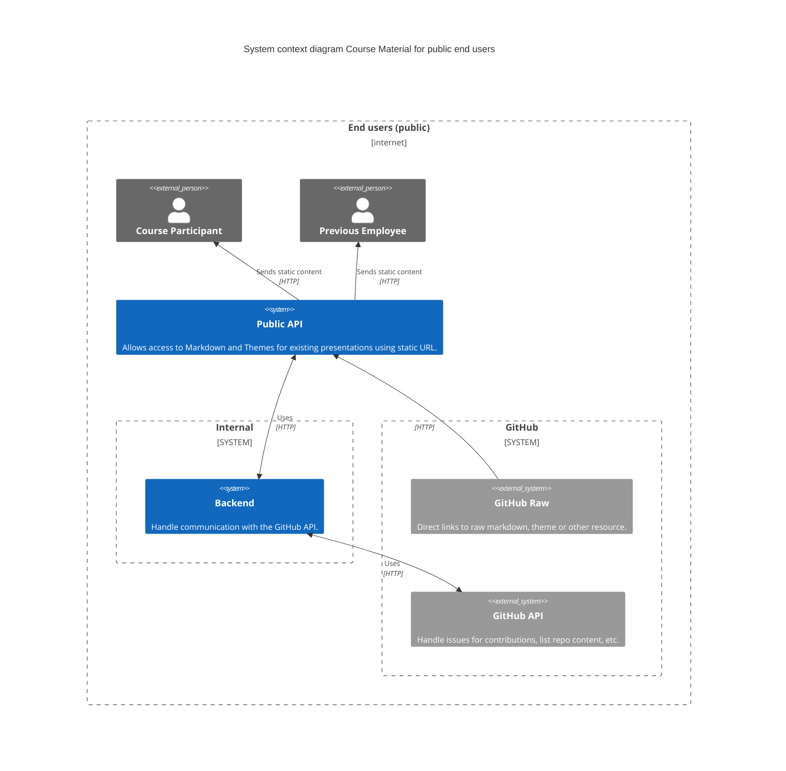

# Course Material System

## Use Case: Public End Users

```mermaid
C4Context
    title System context diagram Course Material for public end users

    Boundary(b0, "End users (public)", "internet") {
        Person_Ext(userA, "Course Participant", "")
        Person_Ext(userB, "Previous Employee")

        System(SystemAPI, "Public API", "Allows access to Markdown and Themes for existing presentations using static URL.")

        %% Static content from public API
        Rel(SystemAPI, userA, "Sends static content", "HTTP")
        Rel(SystemAPI, userB, "Sends static content", "HTTP")

        %% Inter system communication
        Rel(SystemGithubRAW, SystemAPI, "", "HTTP")
        BiRel(SystemGithubAPI, SystemService, "Uses", "HTTP")
        BiRel(SystemService, SystemAPI, "Uses", "HTTP")

        System_Boundary(b1, "Internal") {
            System(SystemService, "Backend", "Handle communication with the GitHub API.")
        }

        System_Boundary(bGithub, "GitHub") {
            System_Ext(SystemGithubRAW, "GitHub Raw", "Direct links to raw markdown, theme or other resource.")
            System_Ext(SystemGithubAPI, "GitHub API", "Handle issues for contributions, list repo content, etc.")
        }
    }

    UpdateLayoutConfig($c4ShapeInRow="2", $c4BoundaryInRow="2")
```
