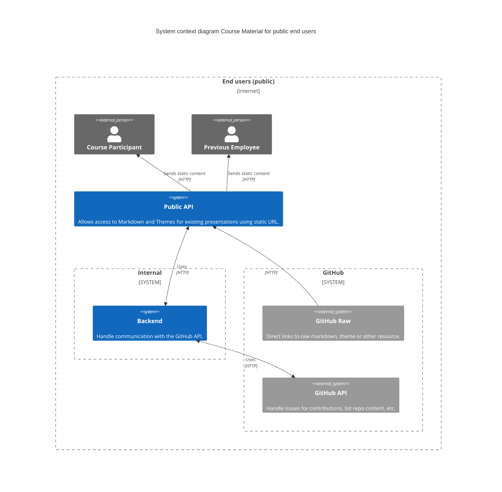
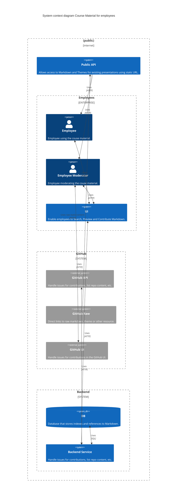

# Course Material System

## Use Case: Public End Users

```mermaid
C4Context
    title System context diagram Course Material for public end users

    Boundary(b0, "End users (public)", "internet") {
        Person_Ext(userA, "Course Participant", "")
        Person_Ext(userB, "Previous Employee")

        System(SystemAPI, "Public API", "Allows access to Markdown and Themes for existing presentations using static URL.")

        %% Static content from public API
        Rel(SystemAPI, userA, "Sends static content", "HTTP")
        Rel(SystemAPI, userB, "Sends static content", "HTTP")

        %% Inter system communication
        Rel(SystemGithubRAW, SystemAPI, "", "HTTP")
        BiRel(SystemGithubAPI, SystemService, "Uses", "HTTP")
        BiRel(SystemService, SystemAPI, "Uses", "HTTP")

        System_Boundary(b1, "Internal") {
            System(SystemService, "Backend", "Handle communication with the GitHub API.")
        }

        System_Boundary(bGithub, "GitHub") {
            System_Ext(SystemGithubRAW, "GitHub Raw", "Direct links to raw markdown, theme or other resource.")
            System_Ext(SystemGithubAPI, "GitHub API", "Handle issues for contributions, list repo content, etc.")
        }
    }

    UpdateLayoutConfig($c4ShapeInRow="2", $c4BoundaryInRow="2")
```

## Use Case: Employees

```mermaid
C4Context
    title System context diagram Course Material for employees

    Boundary(b0, "(public)", "internet") {
        System(SystemAPI, "Public API", "Allows access to Markdown and Themes for existing presentations using static URL.")

        Rel(SystemGithubRAW, SystemAPI, "Uses raw static content", "HTTP")
        UpdateRelStyle(SystemGithubRAW, SystemAPI, $offsetY="130", $offsetX="-140")

        Enterprise_Boundary(b1, "Employees") {
            Person(employeeA, "Employee", "Employee using the couse material.")
            Person(employeeB, "Employee Moderator", "Employee moderating the couse material.")

            System(SystemUI, "UI", "Enable employees to Search, Preview and Contribute Markdown.")

            %% Static content from public API
            Rel(SystemAPI, employeeA, "Uses", "HTTP")
            UpdateRelStyle(SystemAPI, employeeA, $offsetY="-40")
            Rel(SystemAPI, employeeB, "Uses", "HTTP")
            UpdateRelStyle(SystemAPI, employeeB, $offsetY="-40")

            %% Interaction with UI
            BiRel(SystemUI, employeeA, "Uses", "HTTP")
            BiRel(SystemUI, employeeB, "Uses", "HTTP")

            %% Interaction with the GitHub UI
            BiRel(SystemGithub, employeeB, "Uses", "HTTP")

            %% Inter system communication
            BiRel(SystemService, SystemUI, "Uses", "HTTP")
            BiRel(SystemDB, SystemService, "Uses", "SQL")
            BiRel(SystemGithubAPI, SystemService, "Uses", "HTTP")
        }

        System_Boundary(bGithub, "GitHub") {
            System_Ext(SystemGithubAPI, "GitHub API", "Handle issues for contributions, list repo content, etc.")
            System_Ext(SystemGithubRAW, "GitHub Raw", "Direct links to raw markdown, theme or other resource.")
            System_Ext(SystemGithub, "GitHub UI", "Handle issues for contributions in the GitHub UI.")
        }

        System_Boundary(b2, "Backend") {
            SystemDb(SystemDB, "DB", "Database that stores indexes and references to Markdown.")
            System(SystemService, "Backend Service", "Handle issues for contributions, list repo content, etc.")
        }
    }

    UpdateLayoutConfig($c4ShapeInRow="2", $c4BoundaryInRow="1")
```
