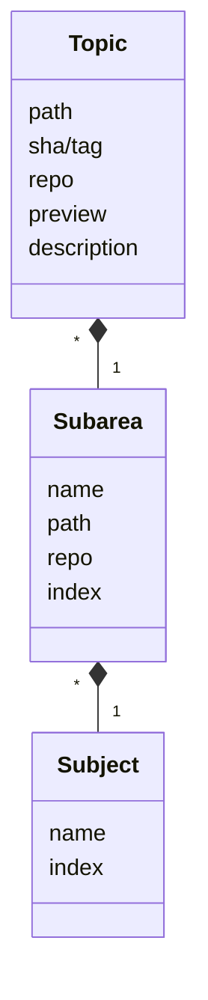
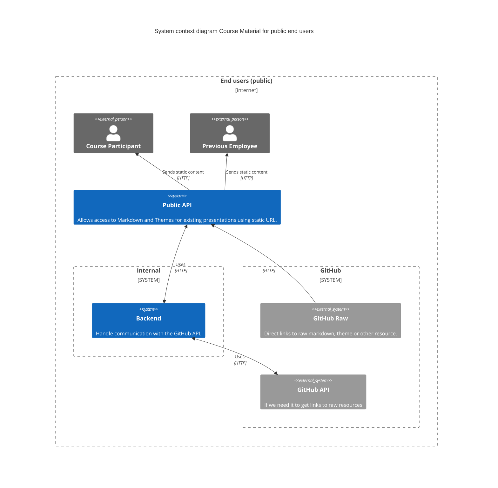
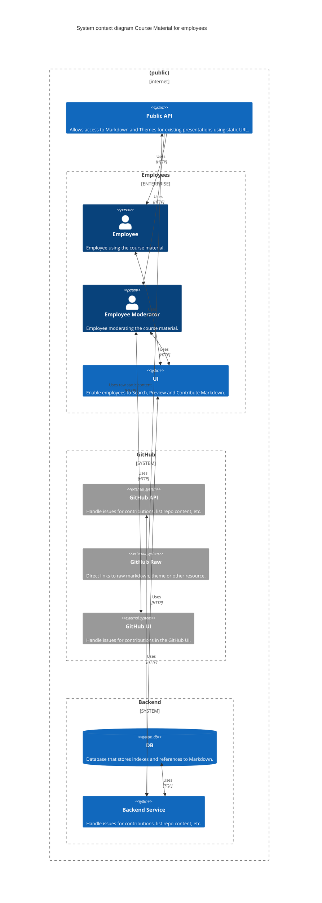
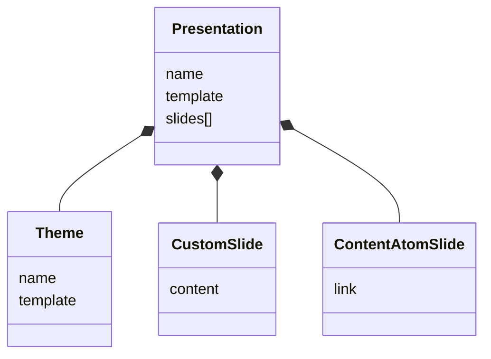

# Course Material System
A system for handling course material as markdown in GitHub repos.

## Course Material
Course material should be split into small reuseable parts, topics. Each topic
is categorized and stored in GitHub repos together with other related topics.

```
repo/<subject>/<subarea>/<topic>.md
```

- A subject could be a programming language or a framework.

- A subarea could be a concept in a language or some part of a framework.

- A topic could be a specific keyword or construct in a language of a specific
  API in a framework.



## Use Case: Public End Users
In this use case users are unauthenticated and could be for example course
participants or previous employees.



### Public API
This API does not require authentication. It acts like a proxy and possibly a
cache for resources that would otherwise require authentication. Is is used to
give public access to markdown, themes and resources used in presentations.

Markdown and other resources is fetched from GitHub using raw files from the
main GitHub site or using the GitHub API and
[octokit.js](https://github.com/octokit/octokit.js).

Access to resources using raw files could possibly just redirect to GitHub,
as access to to each raw files is using a unique token per file.


## Use Case: Employees
In this use case users are authenticated and could be for example employees.



### Employee
Regular employees use the [Public API](#public-api) and an internal UI that
require authentication.

### Employee Moderator
Employees that moderate course material use the Public API and the internal UI.
To moderate contributions from regular employees they use GitHubs UI for issues.

### Backend Service
- Handles access to the GitHub API.
- Indexing and preview of markdown and themes.
- Create issues thru the GitHub API for contributions to markdown and themes.
- Provides search for markdown.
- Manage presentations in local DB or possibly on GitHub.


## The presentation data structure


### Theme
This is either the name of a predefined theme in
[reveal.js](https://revealjs.com/) or a custom theme.

### Slides
This is the content of the presentation.
Slides can be created either specific for this presentation or be a reference
to a moderated slide from existing course material.


## Editor for Markdown
### REMEDI - REveal.js Markdown EDItor
[fbedussi/reveal-js-editor on GitHub](https://github.com/fbedussi/reveal-js-editor)

REMEDI is a cross platform editor (build upon the electron framework) to author reveal.js presentation in markdown.

It seems to be partially functional and was last updated in December 2020.

### Reveal-md
[patarapolw/reveal-md on GitHub](https://github.com/patarapolw/reveal-md)

Reveal.js x Markdown (Showdown.js) editor, CLI and viewer.

Last updated in December 2019.

### Showdown
[showdownjs/showdown on GitHub](https://github.com/showdownjs/showdown)

Showdown is a JavaScript Markdown to HTML converter. Showdown can be used client side (in the browser) or server side (with Node.js).

A general Markdown to HTML converter that could be used for a live preview. Last Updated in November 2022.


## Github API with octokit.js
Octokit.js is the recommended way to use the Github API.

Instructions from [octokit.js on Github](https://github.com/octokit/octokit.js)

[Best practices for using the REST API](https://docs.github.com/en/rest/using-the-rest-api/best-practices-for-using-the-rest-api)

### Install octokit
Install with <code>npm/pnpm install octokit</code>, or <code>yarn add octokit</code>

```js
import { Octokit, App } from "octokit";
```

Create a token with appropriate permissions [Settings / Developer Settings](https://github.com/settings/tokens), [read more about personal access tokens](https://docs.github.com/en/authentication/keeping-your-account-and-data-secure/managing-your-personal-access-tokens).

Test the token with this example: Get the username for the authenticated user.
```js
// Create a personal access token at https://github.com/settings/tokens/new?scopes=repo
const octokit = new Octokit({ auth: `personal-access-token123` });

// Compare: https://docs.github.com/en/rest/reference/users#get-the-authenticated-user
const {
  data: { login },
} = await octokit.rest.users.getAuthenticated();
console.log("Hello, %s", login);
```

### Throttling and Limitations
Read and handle [rate limits for the REST API](https://docs.github.com/en/rest/using-the-rest-api/rate-limits-for-the-rest-api).

> You can use a personal access token to make API requests. Additionally, you can authorize a GitHub App or OAuth app, which can then make API requests on your behalf.
>
> All of these requests count towards your personal rate limit of 5,000 requests per hour. Requests made on your behalf by a GitHub App that is owned by a GitHub Enterprise Cloud organization have a higher rate limit of 15,000 requests per hour. Similarly, requests made on your behalf by a OAuth app that is owned or approved by a GitHub Enterprise Cloud organization have a higher rate limit of 15,000 requests per hour if you are a member of the GitHub Enterprise Cloud organization.

### Caching
As SHA:s for resources in a Git repo will never change, caching of course material fetched using the Github API can be permanent and never expire, as long as urls contain a specific SHA. Therefore throttling and limitations of the number of requests to the Github API should not be a big issue.

### Some Relevant Endpoints
#### Get the content of a file/directory
- [REST API endpoints for repository contents](https://docs.github.com/en/rest/repos/contents)

Example: Get a list of all files in the root directory of the repository on the master branch.
```js
const octokit = new Octokit({ auth: env.GITHUB_TOKEN });

try
{
  const data = await octokit.rest.repos.getContent({
    owner: "angelstam",
    repo: "course-material-system",
    path:"",
    ref: "master",
  });
  console.log(data);
} catch (e) {
  console.error(e);
}
```

The content of a specific file is retrieved using the `download_url` parameter with the following format.
```
https://raw.githubusercontent.com/:owner/:repo/:ref/:path?token=<optional token for access to files in private repos>"
```

To enable efficient caching of content, files shall always be accessed using a specific commit SHA. The valid commit SHA:s for a specific file can be obtained using the following example.

Example: Get all commits/versions of a specific file.
```js
try
{
  const data = await octokit.rest.repos.listCommits({
    owner: "angelstam",
    repo: "course-material-system",
    path:"README.md",
    ref: "master",
  });
  console.log(data);
} catch (e) {
  console.error(e);
}
```

For private repos the `download_url` can be retrieved using the following example.

Example: Get details and `download_url` for a specific file.
```js
try
{
  const data = await octokit.rest.repos.getContent({
    owner: "angelstam",
    repo: "course-material-system",
    path:"README.md",
    ref: "98948c9c8b45c78c65b632481d0e153bbbf5ccf0",
  });
  console.log(data);
} catch (e) {
  console.error(e);
}
```

For public repos the specific revision of a file can be fetched directly using the following format.
```
https://raw.githubusercontent.com/:owner/:repo/:ref/:path
```

#### Issues and comments
Github issues could be used when working with moderation of content.
- [REST API endpoints for issues](https://docs.github.com/en/rest/issues/issues)
- [REST API endpoints for issue comments](https://docs.github.com/en/rest/issues/comments)

Example: Get a list of all issues.
```js
const octokit = new Octokit({ auth: env.GITHUB_TOKEN });

try
{
  const data = await octokit.rest.issues.list({
    owner: "angelstam",
    repo: "course-material-system",
  });
  console.log(data);
} catch (e) {
  console.error(e);
}
```


## Future expansion
- Support for more content types like images and other generic files.
- Support for multiple Github repos.
- Support for other file storage services.
- Login with single sign-on using Azure or other external login.
