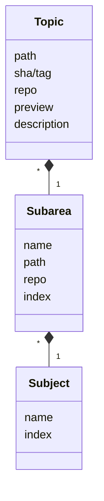
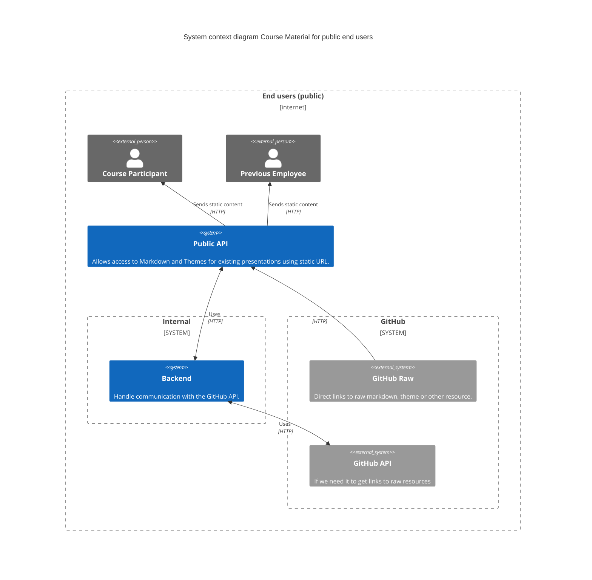
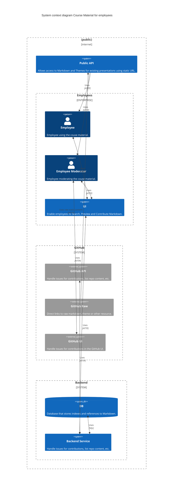
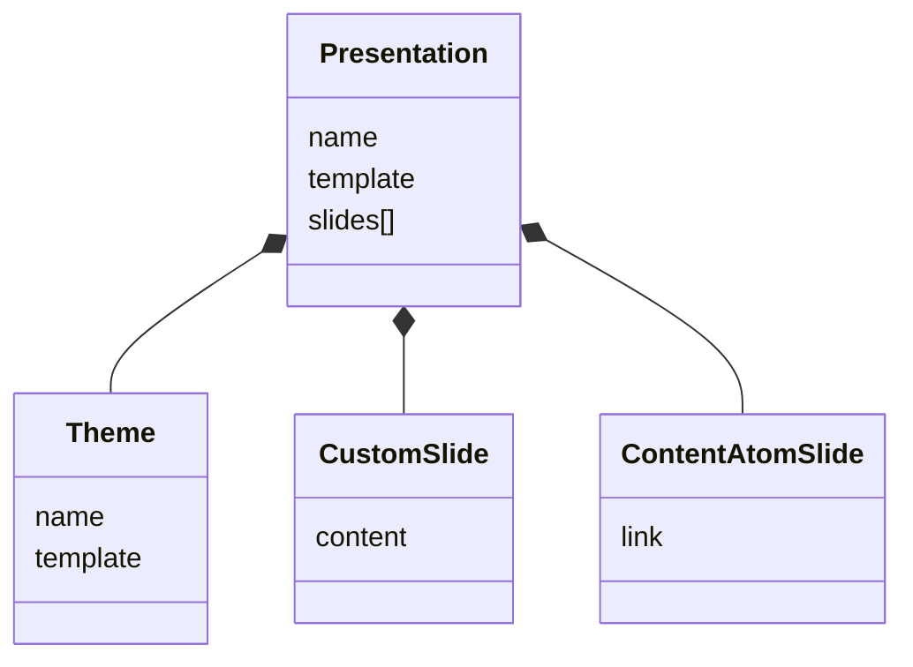

# Course Material System
A system for handling course material as markdown in GitHub repos.

## Course Material
Course material should be split into small reuseable parts, topics. Each topic
is categorized and stored in GitHub repos together with other related topics.

```
repo/<subject>/<subarea>/<topic>.md
```

- A subject could be a programming language or a framework.

- A subarea could be a concept in a language or some part of a framework.

- A topic could be a specific keyword or construct in a language of a specific
  API in a framework.



## Use Case: Public End Users
In this use case users are unauthenticated and could be for example course
participants or previous employees.



### Public API
This API does not require authenticatio. It acts like a proxy and possibly a
cache for resources that would otherwise require authentication. Is is used to
give public access to markdown, themes and resources used in presentations.

Markdown and other resources is fetched from GitHub using raw files from the
main GitHub site or using the GitHub API and
[octokit.js](https://github.com/octokit/octokit.js).

Access to resources using raw files could possibly just redirect to GitHub,
as access to to each raw files is using a unique token per file.


## Use Case: Employees
In this use case users are authenticated and could be for example employees.



### Employee
Regular employees use the [Public API](#public-api) and an internal UI that
require authentication.

### Employee Moderator
Employees that moderate course material use the Public API and the internal UI.
To moderate contributions from regualar employees they use GitHubs UI for issues.

### Backend Service
- Handles access to the GitHub API.
- Indexing and preview of markdown and themes.
- Create issues thru the GitHub API for contributions to markdown and themes.
- Provides search for markdown.
- Manage presentations in local DB or possibly on GitHub.


## The presentation data structure


### Theme
This is either the name of a predefined theme in
[reveal.js](https://revealjs.com/) or a custom theme.

### Slides
This is the content of the presentation.
Slides can be created either specific for this presentation or be a reference
to a moderated slide from existing course material.
